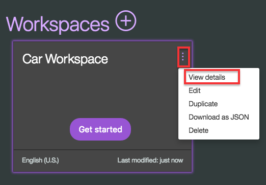

Node-RED IBM Cloud Starter Application
====================================

### Node-RED on IBM Cloud - Edited

This is modified version of Node-Red boilerplate code. This basically combines the Node-Red and Simple Conversation repos.

This repository is an example Node-RED application that can be deployed into
IBM Cloud with only a couple clicks. Try it out for yourself right now by clicking:

[](https://bluemix.net/deploy?repository=https://github.com/KKaski/node-red-with-conversation.git)

### How does this work?

When you click the button, you are taken to IBM Cloud where you get a pick a name
for your application at which point the platform takes over, grabs the code from
this repository and gets it deployed.

It will automatically create an instance of the Cloudant service, call it
`sample-node-red-cloudantNoSQLDB` and bind it to you app. This is where your
Node-RED instance will store its data. If you deploy multiple instances of
Node-RED from this repository, they will share the one Cloudant instance.


When you first access the application, you'll be asked to set some security options
to ensure your flow editor remains secure from unauthorised access.

It includes a set of default flows that are automatically deployed the first time
Node-RED runs.

### Customising Node-RED

This repository is here to be cloned, modified and re-used to allow anyone create
their own Node-RED based application that can be quickly deployed to IBM Cloud.

The default flows are stored in the `defaults` directory in the file called `flow.json`.
When the application is first started, this flow is copied to the attached Cloudant
instance. When a change is deployed from the editor, the version in cloudant will
be updated - not this file.

The web content you get when you go to the application's URL is stored under the
`public` directory.

Additional nodes can be added to the `package.json` file and all other Node-RED
configuration settings can be set in `bluemix-settings.js`.

If you do clone this repository, make sure you update this `README.md` file to point
the `Deploy to IBM Cloud` button at your repository.

If you want to change the name of the Cloudant instance that gets created, the memory
allocated to the application or other deploy-time options, have a look in `manifest.yml`.

# Conversation Sample Application [](http://travis-ci.org/watson-developer-cloud/conversation-simple) [](https://codecov.io/github/watson-developer-cloud/conversation-simple?branch=master)

This Node.js app demonstrates the Conversation service in a simple chat interface simulating a cognitive car dashboard.


You can view a [demo][demo_url] of this app.

### Setting up the Conversation service

You can use an exisiting instance of the Conversation service. Otherwise, follow these steps.

1. At the command line, go to the local project directory (`conversation-simple`).

1. Connect to Bluemix with the Cloud Foundry command-line tool. For more information, see the Watson Developer Cloud [documentation][cf_docs].
    ```bash
    cf login
    ```

1. Create an instance of the Conversation service in Bluemix. For example:

    ```bash
    cf create-service conversation free my-conversation-service
    ```

### Importing the Conversation workspace

1. In your browser, navigate to [your Bluemix console] (https://console.ng.bluemix.net/dashboard/services).

1. From the **All Items** tab, click the newly created Conversation service in the **Services** list.

    

1. On the Service Details page, click **Launch tool**.

1. Click the **Import workspace** icon in the Conversation service tool. Specify the location of the workspace JSON file in your local copy of the app project:

    `<project_root>/training/car_workspace.json`

1. Select **Everything (Intents, Entities, and Dialog)** and then click **Import**. The car dashboard workspace is created.

### Configuring the Conversation Bindings

1. Bind the runtime with the created Watson Conversation Service

1. Add the following flow to the node-red canvas

[{"id":"f2f2649a.0d0d98","type":"debug","z":"39a2c5e9.be8d52","name":"","active":true,"console":"false","complete":"false","x":450,"y":100,"wires":[]},{"id":"8745bb36.a6f1f","type":"http in","z":"39a2c5e9.be8d52","name":"","url":"/api/message","method":"post","upload":false,"swaggerDoc":"","x":110,"y":100,"wires":[["f2f2649a.0d0d98","da232bff.e970d8"]]},{"id":"9bee37d8.e4cad8","type":"watson-conversation-v1","z":"39a2c5e9.be8d52","name":"","workspaceid":"5cefbe2c-56c3-4d24-893a-298f0803ca12","multiuser":false,"context":false,"empty-payload":false,"default-endpoint":true,"service-endpoint":"https://gateway.watsonplatform.net/conversation/api","x":450,"y":220,"wires":[["1233dccc.41a72b","2ba45538.6baaaa"]]},{"id":"1233dccc.41a72b","type":"debug","z":"39a2c5e9.be8d52","name":"","active":true,"tosidebar":true,"console":false,"tostatus":false,"complete":"false","x":690,"y":280,"wires":[]},{"id":"2ba45538.6baaaa","type":"http response","z":"39a2c5e9.be8d52","name":"","statusCode":"","headers":{},"x":650,"y":360,"wires":[]},{"id":"da232bff.e970d8","type":"function","z":"39a2c5e9.be8d52","name":"","func":"if(msg.payload.context!==undefined)\n    msg.params = {context:msg.payload.context}\n    \nmsg.payload = msg.payload.input.text\nreturn msg;","outputs":1,"noerr":0,"x":270,"y":220,"wires":[["9bee37d8.e4cad8"]]}]

1. In your Bluemix console, open the Conversation service instance where you imported the workspace.

1. Click the menu icon in the upper-right corner of the workspace tile, and then select **View details**.

    

1. Click the  icon to copy the workspace ID to the clipboard.

1. On Node-Red flow editor copy the workspace id to Watson Conversation node


## Testing the app

After your app is installed and running, experiment with it to see how it responds.

The chat interface is on the left, and the JSON that the JavaScript code receives from the Conversation service is on the right. Your questions and commands are interpreted using a small set of sample data trained with the following intents:

    turn_on
    turn_off
    turn_up
    turn_down
    traffic_update
    locate_amenity
    weather
    phone
    capabilities
    greetings
    goodbyes

Type a request, such as `music on` or `I want to turn on the windshield wipers`. The system understands your intent and responds. You can see the details of how your input was understood by examining the JSON data in the `Watson understands` section on the right side.

For example, if you type `Turn on some music`, the JSON data shows that the system understood the `turn_on` intent with a high level of confidence, along with the `appliance` entity with a value of `music`.

For more information about intents, see the [Conversation service documentation][doc_intents].

To see details of how these intents are defined, including sample input for each intent, launch the Conversation tool.

## Modifying the app

After you have the app deployed and running, you can explore the source files and make changes. Try the following:

* Modify the .js files to change the app logic.
* Modify the .html file to change the appearance of the app page.
* Use the Conversation tool to train the service for new intents, or to modify the dialog flow. For more information, see the [Conversation service documentation][docs_landing].

## Deploying to Kubernetes service 

You can use Cloud Foundry to deploy your local version of the app to Bluemix.

1. In the project root directory, create Dockerfile:

We are going to run the node-red from the local filesystem with local settings
By default it will expose 1880 port which will be mapped to Kubernets NodePort
HEre is example of the dockerfile

FROM ibmcom/ibmnode

ADD . /app

ENV NODE_ENV production
ENV PORT 1880

EXPOSE 1880

WORKDIR "/app"

RUN apt-get update --yes && apt-get upgrade --yes
RUN npm install
CMD node --max-old-space-size=384 node_modules/node-red/red.js --settings ./local-settings.js --userDir . flows.json

2. Add the Docker build and Docker Deploy stages to your deliverypipeline
You wil need to generate API keys for the deliverypipeline Manage/Security/Platform API Keys

  
## Troubleshooting

If you encounter a problem, you can check the logs for more information. To see the logs, run the `cf logs` command:

```none
cf logs <application-name> --recent
```

## License

This sample code is licensed under Apache 2.0.
Full license text is available in [LICENSE](LICENSE).

## Contributing

See [CONTRIBUTING](CONTRIBUTING.md).

## Open Source @ IBM

Find more open source projects on the
[IBM Github Page](http://ibm.github.io/).


[cf_docs]: (https://console.bluemix.net/docs/services/watson/getting-started-cf.html)
[cloud_foundry]: https://github.com/cloudfoundry/cli#downloads
[demo_url]: http://conversation-simple.ng.bluemix.net/
[doc_intents]: (https://console.bluemix.net/docs/services/conversation/intents-entities.html#planning-your-entities)
[docs]: https://console.bluemix.net/docs/services/conversation/index.html
[docs_landing]: (https://console.bluemix.net/docs/services/conversation/index.html)
[node_link]: (http://nodejs.org/)
[npm_link]: (https://www.npmjs.com/)
[sign_up]: bluemix.net/registration

